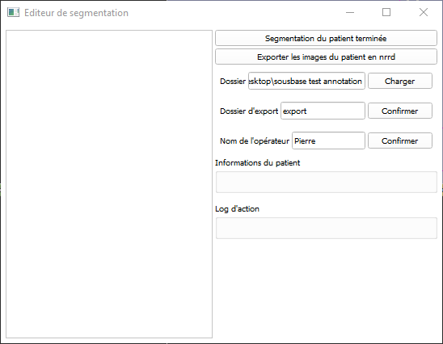

# Slicer annotation tool

This tool adds a floationg window making easier the process of annotating patients. It automates saving patient segmentation to a predefined folder, adds timestamp, operator name to the saved nrrd files, allows to switch to the next patient easily, can display patient information to help the operator... 

## Installation instruction

[[The project wiki page]](https://github.com/ThibaultSau/Slicer-Annotation/wiki) contains an installation tutorial (spoiler, just move a file) and a quick segmentation tutorial for slicer.

## Main features

The window contains patient information and several buttons that automate tedious clicking tasks in slicer.
